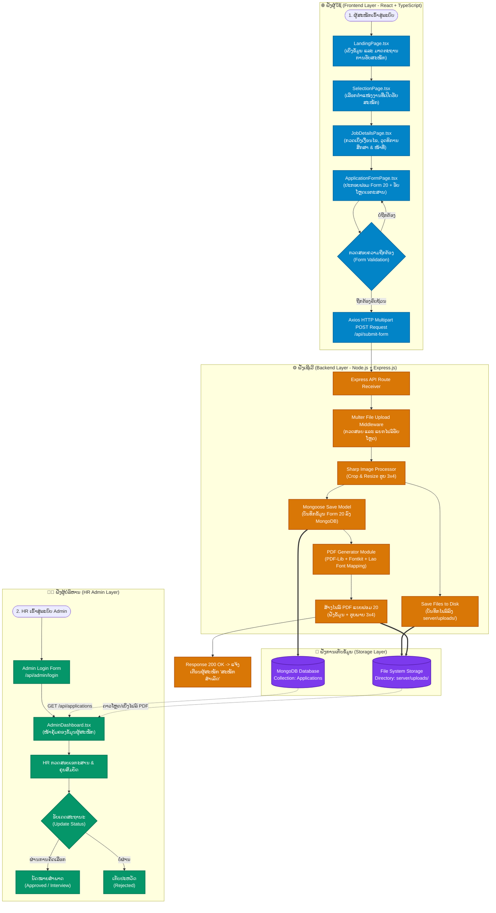
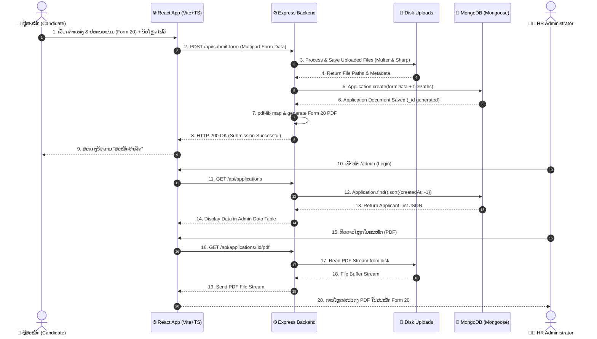

# ຜັງງານລະບົບ ແລະ ການໄຫຼຂອງຂໍ້ມູນລະອຽດ (High-Resolution System & Data Flowchart)
## ໂຄງການ: ລະບົບສະໝັກວຽກອອນລາຍ LTC (LTC Online Recruitment System)

---

## 1. ພາບລວມຂອງເທັກໂນໂລຢີ ແລະ ການເກັບຂໍ້ມູນ (Technology & Storage Architecture)

| ສ່ວນປະກອບ (Component) | ເທັກໂນໂລຢີ / ພາສາທີ່ໃຊ້ (Technology & Language) | ໜ້າທີ່ ແລະ ລາຍລະອຽດ (Role & Details) |
| :--- | :--- | :--- |
| **Frontend (Client)** | React 19 + TypeScript + Vite | ພັດທະນາ UI ທີ່ໄວ, ມີ Type Safety, ຈັດການ Form ແລະ UI Components |
| **UI & Styling** | Tailwind CSS + Lucide React | ອອກແບບ Responsive Design, ອိုင်ຄອນ modern ງາມຕາ |
| **HTTP Client** | Axios | ສົ່ງຂໍ້ມູນ Form (Multipart Data) ແລະ ຮຽກໃຊ້ REST APIs |
| **Backend (Server)** | Node.js + Express.js | ຈັດການ Routing, API Endpoint, Upload Middleware, ປະມວນຜົນ PDF |
| **Database Storage** | MongoDB + Mongoose ORM | ເກັບຂໍ້ມູນໂຄງສ້າງໃບສະໝັກ (Form 20 Data, ປະຫວັດການສຶກສາ, ປະຫວັດການເຮັດວຽກ) |
| **File System Storage** | Local Disk Storage (`server/uploads/`) | ເກັບໄຟລ໌ຮູບ 3x4, ບັດປະຈຳຕົວ, ສຳເນົາສຳມະໂນຄົວ, ໃບປະກາດ, ໃບກວດສຸຂະພາບ, ໃບແຈ້ງໂທດ |
| **Image Processing** | Sharp | ປັບຂະໜາດ ແລະ Optimize ຮູບ 3x4 ຂອງຜູ້ສະໝັກ |
| **PDF Generation Engine** | PDF-Lib + Fontkit | ສ້າງໄຟລ໌ PDF ແບບຟອມ 20 ອັດຕະໂນມັດ ໂດຍຝັງຟອນ Lao (Phetsarath/Noto Sans Lao) |

---

## 2. ຜັງງານການໄຫຼຂອງລະບົບທັງໝົດ (End-to-End System Flowchart)



---

## 3. ການໄຫຼຂອງຂໍ້ມູນ ແລະ API Dynamic Data Flow



---

## 4. ໂຄງສ້າງການເກັບຂໍ້ມູນ (Database Schema & File Structure)

### 4.1 Data Schema (`Application` Model)
```json
{
  "_id": "ObjectId",
  "positionApplied": "String (ຕຳແໜ່ງທີ່ສະໝັກ)",
  "fullName": "String (ຊື່ ແລະ ນາມສະກຸນ)",
  "gender": "String (ເພດ)",
  "dob": "Date (ວັນເດືອນປີເກີດ)",
  "phone": "String (ເບີໂທລະສັບ)",
  "email": "String (ອີເມວ)",
  "address": "Object (ທີ່ຢູ່ປະຈຸບັນ)",
  "education": "Array of Objects (ປະຫວັດການສຶກສາ)",
  "workExperience": "Array of Objects (ປະຫວັດການເຮັດວຽກ)",
  "familyMembers": "Array of Objects (ຂໍ້ມູນຄອບຄົວ)",
  "languages": "Object (ຄວາມສາມາດດ້ານພາສາ)",
  "status": "String ('Pending' | 'Approved' | 'Rejected')",
  "files": {
    "photo": "String (ເສັ້ນທາງຮູບ 3x4)",
    "idCard": "String (ເສັ້ນທາງບັດປະຈຳຕົວ)",
    "censusBook": "String (ເສັ້ນທາງສຳມະໂນຄົວ)",
    "resume": "String (ເສັ້ນທາງ CV/Resume)",
    "diploma": "String (ເສັ້ນທາງໃບປະກາດ)",
    "generatedPdf": "String (ເສັ້ນທາງ PDF Form 20 ທີ່ລະບົບສ້າງ)"
  },
  "createdAt": "Timestamp",
  "updatedAt": "Timestamp"
}
```

---

## 5. ສະຫຼຸບຈຸດເດັ່ນຂອງໂຄງສ້າງລະບົບ (System Architecture Highlights)

1. **Modular Architecture:** ແຍກສ່ວນ Client (React) ແລະ Server (Express) ຢ່າງຈະແຈ້ງ ເຮັດໃຫ້ງ່າຍຕໍ່ການບຳລຸງຮັກສາ.
2. **Dynamic PDF Rendering Engine:** ໃຊ້ `pdf-lib` + `fontkit` ເພື່ອດຶງຂໍ້ມູນຈາກ MongoDB ແລ້ວມາ Mapping ໃສ່ Coordinates ໃນ PDF Form 20 ອັດຕະໂນມັດ ໂດຍຮອງຮັບ ພາສາລາວ 100%.
3. **Optimized Media Pipeline:** ໃຊ້ `Sharp` ໃນການປະມວນຜົນ ແລະ ບີບອັດຮູບ 3x4 ເພື່ອໃຫ້ PDF ມີຂະໜາດນ້ອຍ ແລະ ຄົມຊັດ.
4. **Secure File Storage:** ຈັດເກັບໄຟລ໌ເອກະສານຢ່າງເປັນລະບົບໃນ `server/uploads/` ພ້ອມ linkage ອ້າງອີງໃນ Database.
