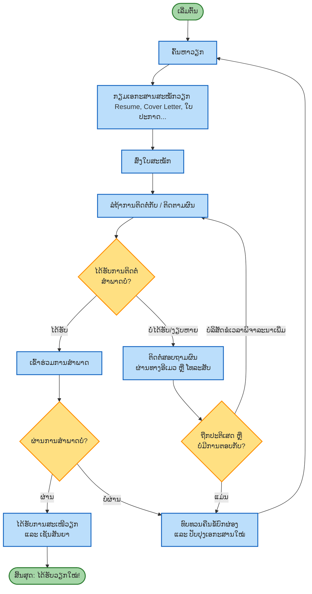

# ຂະບວນການສະໝັກວຽກ (Job Application Flowchart)

ນີ້ແມ່ນແຜນວາດ (Flowchart) ທີ່ສະແດງເຖິງຂັ້ນຕອນຕ່າງໆໃນການສະໝັກວຽກ ຕັ້ງແຕ່ເລີ່ມຕົ້ນຈົນເຖິງຂັ້ນຕອນການຕັດສິນໃຈຕ່າງໆ. ສາມາດເບິ່ງໄດ້ໂດຍໃຊ້ເຄື່ອງມືທີ່ຮອງຮັບ Mermaid Diagram (ເຊັ່ນ: GitHub, ຫຼື Extension ໃນ VS Code).

